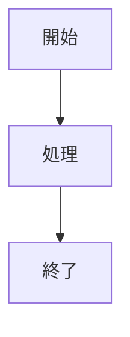

# Zenn Markdown記法 詳細ガイド

このドキュメントは、Zenn特有のMarkdown記法の詳細リファレンスです。

## 基本的なMarkdown

Zennは標準的なMarkdownをサポートしています。見出し、リスト、リンク、画像、コードブロックなど、一般的なMarkdown記法が使用できます。

## メッセージブロック

スタイル付きの通知ボックスを作成できます。

### 通常のメッセージ

```markdown
:::message
ここにメッセージを記載します
:::
```

### アラートメッセージ

警告表示には `alert` バリアントを使用します（異なる色で表示されます）。

```markdown
:::message alert
重要な警告メッセージ
:::
```

## アコーディオン（折りたたみ）

クリックで展開可能なセクションを作成できます。

### 基本的な使い方

```markdown
:::details タイトル
ここに隠すコンテンツを記載
:::
```

### ネストされたアコーディオン

ネストする場合は、外側のコンテナに追加のコロンを使用します。

```markdown
::::details 外側のタイトル
内容

:::details 内側のタイトル
ネストされた内容
:::

::::
```

## コードブロックの拡張機能

### ファイル名の表示

言語識別子の後に `:ファイル名` を追加します。

````markdown
```js:app.js
console.log('Hello, Zenn!');
```
````

### Diff表示

diffと言語を組み合わせて、変更箇所を強調表示できます。

````markdown
```diff js
- const old = 'old value';
+ const new = 'new value';
```
````

## 埋め込みコンテンツ

### リンクカード

URLを単独行に配置するか、`@[card]` 記法を使用してプレビューカードを生成します。

```markdown
https://example.com

@[card](https://example.com)
```

### ソーシャルメディア

**Twitter/X:**
Twitter/XのポストURLを直接貼り付けると自動的に埋め込まれます。

```markdown
https://twitter.com/username/status/1234567890
```

リプライスレッドを非表示にするには `conversation=none` パラメータを使用します。

```markdown
https://twitter.com/username/status/1234567890?conversation=none
```

### 動画とマルチメディア

**YouTube:**
YouTube動画のURLを直接配置するか、専用記法を使用します。

```markdown
https://www.youtube.com/watch?v=VIDEO_ID

@[youtube](VIDEO_ID)
```

**その他のプラットフォーム:**
- GitHub files
- CodePen
- Figma
- その他多数のプラットフォームに対応

直接URL配置または `@[platform](URL)` 記法で埋め込めます。

### コードプラットフォーム

以下のプラットフォームをサポートしています：

- GitHub Gist
- CodeSandbox
- StackBlitz
- JSFiddle
- blueprintUE

```markdown
@[codesandbox](SANDBOX_ID)
@[stackblitz](PROJECT_ID)
@[jsfiddle](FIDDLE_ID)
```

## 数式表現

KaTeXによる数式表現をサポートしています。

### ディスプレイモード

```markdown
$$
f(x) = \int_{-\infty}^\infty \hat f(\xi)\,e^{2 \pi i \xi x} \,d\xi
$$
```

### インラインモード

```markdown
この式 $E = mc^2$ はインラインで表示されます。
```

## 追加機能

### 脚注

参照マーカー `[^1]` と対応する定義を使用します。

```markdown
本文中の参照[^1]

[^1]: 脚注の内容をここに記載
```

### 図表のサポート

mermaid.js統合により、`mermaid` コードブロックで図表を作成できます。

````markdown

````

**制限事項:**
- 2000文字まで
- 最大10個のチェーン演算子

### HTMLコメント

非表示のメモには HTMLコメントを使用します（単一行のみ）。

```markdown
<!-- これは表示されないコメントです -->
```

### 画像コントロール

**幅の指定:**

```markdown

```

**キャプションの追加:**

画像の下に斜体テキストを配置してキャプションを作成します。

```markdown

*画像のキャプション*
```

## 画像の配置

Zennでは、記事ごとに専用の画像ディレクトリを使用します。

```
/images/[記事ファイル名（拡張子なし）]/[画像ファイル名]
```

例：記事ファイル `20240101-my-article.md` の場合

```
/images/20240101-my-article/screenshot.png
```

記事内での参照：

```markdown

```

## ベストプラクティス

### メッセージブロックの使い分け

- **通常のメッセージ (`:::message`)**: 補足情報、ヒント、参考情報
- **アラートメッセージ (`:::message alert`)**: 警告、注意事項、重要な情報

### コードブロック

- ファイル名を表示することで、読者がどのファイルのコードか理解しやすくなる
- Diff表示は変更箇所を明確にする際に有効

### 埋め込みコンテンツ

- リンクカードは外部記事への参照に便利
- 動画やインタラクティブなコンテンツを埋め込むことで、記事の理解を深められる

### 数式

- 技術的な説明に数式が必要な場合、KaTeX記法を使用
- 複雑な数式はディスプレイモード、簡単な数式はインラインモードを使い分ける

### 図表

- mermaidを使うことで、フローチャートやシーケンス図を記事内で直接作成可能
- 複雑すぎる図表は制限に引っかかる可能性があるため、適度なサイズに抑える
